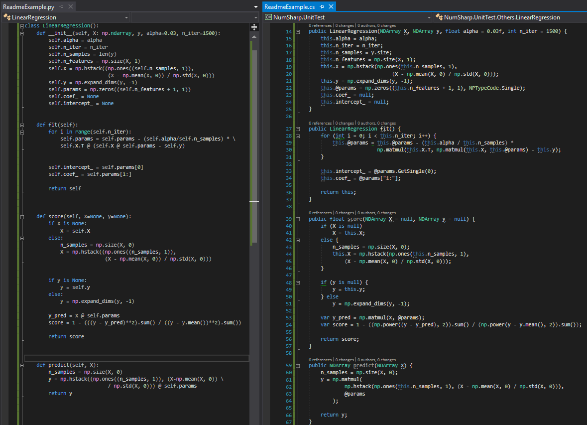

# NumSharp

NumPy port in C# .NET Standard

[](https://gitter.im/numsharp/Lobby)


Is it difficult to translate python machine learning code into C#? Because too many functions can’t be found in the corresponding code in the .Net SDK. NumSharp is the C# version of NumPy, which is as consistent as possible with the NumPy programming interface, including function names and parameter locations. By introducing the NumSharp tool library, you can easily convert from python code to C# code. Here is a comparison code between NumSharp and NumPy (left is python, right is C#):



If you want to read some more informations, we start a doc on https://scisharp.github.io/NumSharp/.

NumSharp has implemented the arange, array, max, min, reshape, normalize, unique interfaces. More and more interfaces will be added to the library gradually. If you want to use .NET to get started with machine learning, NumSharp will be your best tool library.

### Implemented APIs

The NumPy class is a high-level abstraction of NDArray that allows NumSharp to be used in the same way as Python's NumPy, minimizing API differences caused by programming language features, allowing .NET developers to maximize Utilize a wide range of NumPy code resources to seamlessly translate python code into .NET code.

* NumPy
  * absolute
  * amax
  * amin
  * arange
  * array
  * hstack
  * linspace
  * max
  * power
  * random
    * normal
    * randint
    * randn
    * stardard_normal
  * reshape
  * sin
  * vstack
  * zeros
  
### How to use
```
// init NumPy instance which pesists integer data type
var np = new NumPy<int>();
// create a 2-dimension matrix
var nd = np.arange(12).reshape(3, 4);

// access data by index
var data = nd[1, 1];

// create a 3-dimension vector
nd = np.arange(12).reshape(2, 3, 2);
// get the 2nd vector in the 1st dimension
data = n[new Shape(1)];

// get the 3rd vector in the (axis 1, axis 2) dimension
data = n[new Shape(1, 2)];

// interate ndarray
foreach (data in nd)
{
	// data is a ndarray or a value
}
```

### Install NumSharp in NuGet
```
PM> Install-Package NumSharp
```

### How to make docs
- Download docfx and put on PATH &rarr; https://github.com/dotnet/docfx/releases
- ```docfx ./docfx_project/docfx.json -o ./docs```

### How to run benchmark
```
C: \> dotnet NumSharp.Benchmark.dll
```
Reference the [documents](https://scisharp.github.io/NumSharp) generated by DocFX.

Reference the [documents](https://numsharp.readthedocs.io) host on readthedocs.io.

NumSharp is referenced by:
* [Pandas.NET](https://github.com/SciSharp/Pandas.NET)
* [SciSharp-Learn](https://github.com/SciSharp/scisharp-learn)
* [Bigtree.MachineLearning](https://github.com/Oceania2018/Bigtree.MachineLearning)
* [CherubNLP](https://github.com/Oceania2018/CherubNLP)
* [BotSharp](https://github.com/dotnetcore/BotSharp)

NumSharp is a member project of [SciSharp.org](https://github.com/SciSharp) which is the .NET based ecosystem of open-source software for mathematics, science, and engineering.
Welcome to fork and pull request to add more APIs, and make reference list longer.

